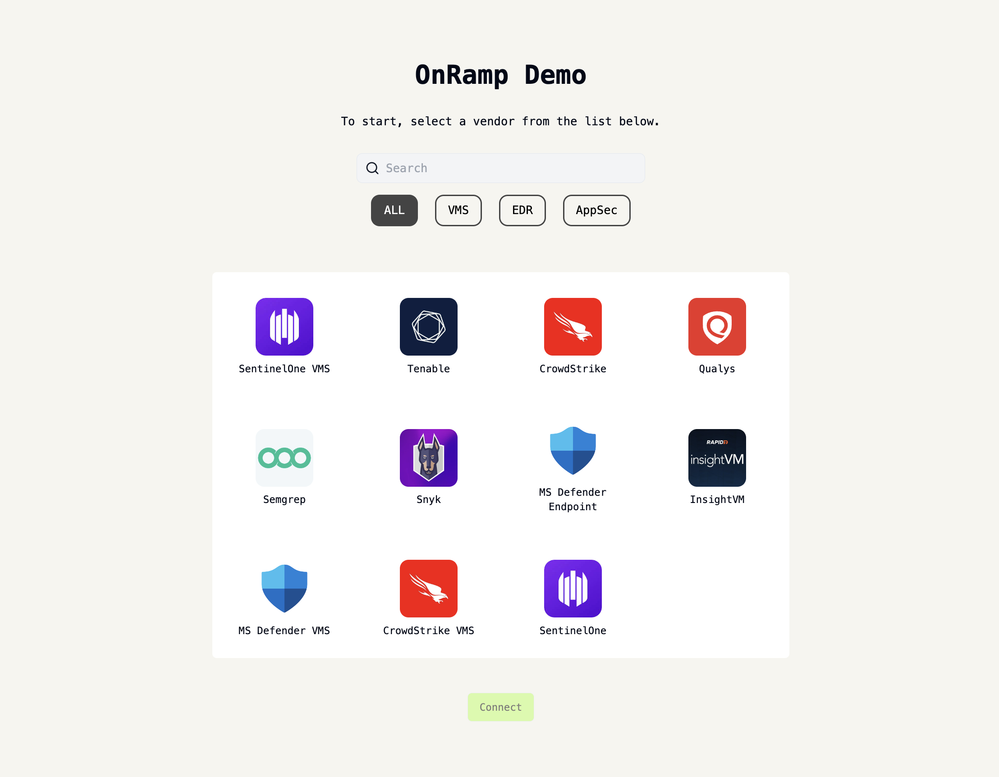

# Leen OnRamp Demo Host App
Demo Host App for Leen's embeddable onboarding component, OnRamp. 



## How to run
First, you'll want to make sure that you have bun installed in your system.

```bash
brew tap oven-sh/bun
brew install bun@1.0.25
```

Next, install all required project dependencies with:

```bash
bun i
```

Then, create a `.env` file and add the following envvars:

```
VITE_REACT_APP_LEEN_BASE_URL=https://api.leen.dev/v1
VITE_REACT_APP_API_KEY=your-api-key
VITE_REACT_APP_ORG_ID=your-org-id
VITE_REACT_APP_ADMIN_USERNAME=username
VITE_REACT_APP_ADMIN_PASSWORD=password
```

You can then run the app by running:

```bash
bun run dev
```

