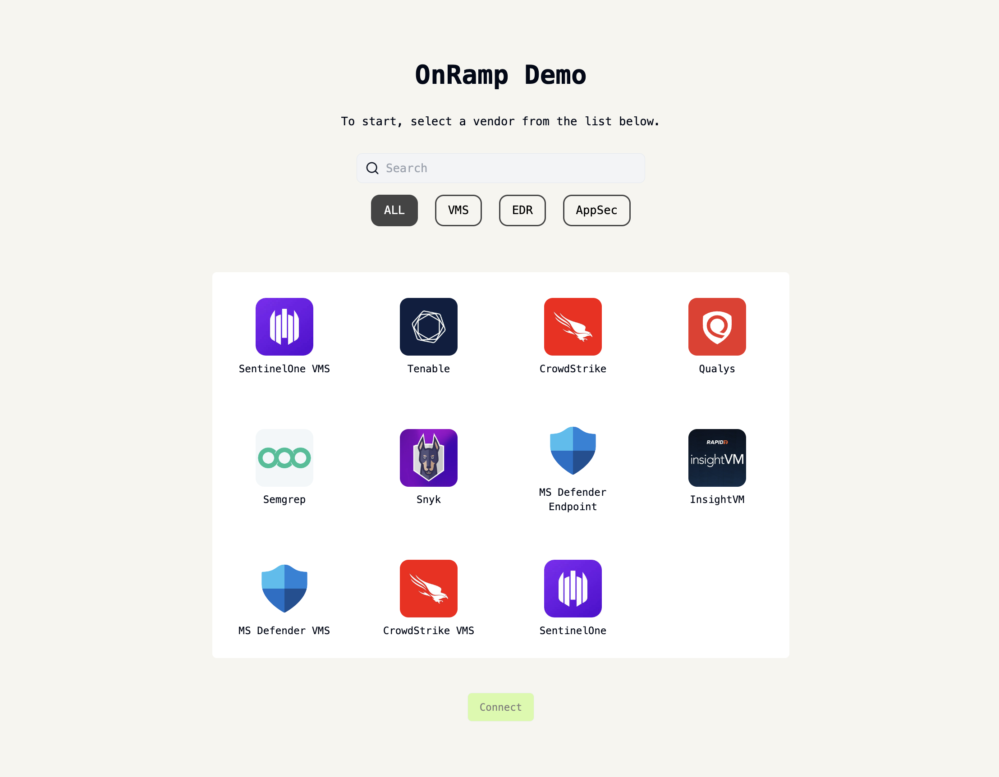

# Leen OnRamp Demo Host App
Demo Host App for Leen's embeddable onboarding component, OnRamp. 



## How to run
First, you'll want to make sure that you have bun installed in your system.

```bash
brew tap oven-sh/bun
brew install bun@1.0.25
```

Next, install all required project dependencies with:

```bash
bun i
```

Then, create a `.env` file and add the following envvars:

```
VITE_REACT_APP_LEEN_BASE_URL=https://api.leen.dev/v1
VITE_REACT_APP_API_KEY=your-api-key
VITE_REACT_APP_ORG_ID=your-org-id
VITE_REACT_APP_ADMIN_USERNAME=username
VITE_REACT_APP_ADMIN_PASSWORD=password
VITE_MOCK_LEEN=true
```

You can then run the app by running:

```bash
bun run dev
```

### About `VITE_MOCK_LEEN`

The "SecurityScorecard – ServiceNow" and "SecurityScorecard – ProcessUnity" tiles demonstrate two
different onRamp integration patterns (see `src/mocks/` and `HostApp.tsx`'s chained-mount flow for
ProcessUnity's two-connection pairing). With `VITE_MOCK_LEEN=true`, a mock service worker
intercepts just those two vendors' invite-token/connection-creation calls, so you can click
through both flows end-to-end without real SecurityScorecard/ProcessUnity credentials — no
connections are actually created. Every other vendor tile is unaffected and still hits the real
Leen API. Set `VITE_MOCK_LEEN=false` (or omit it) to have all vendors, including these two, hit
the real API.

